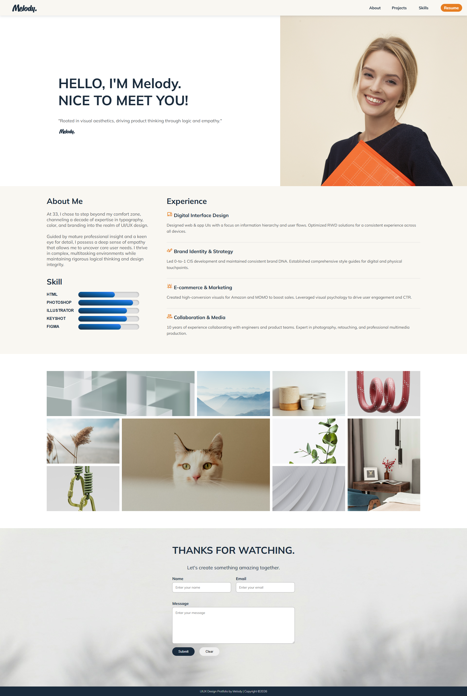
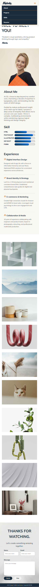

# 個人履歷網站 · Personal Resume Website

以個人品牌為主題的互動式履歷網頁，使用純 HTML5 + CSS3
完成包含多種 CSS 動畫與互動效果。

🔗 **[Live Demo](https://melodyma54316-cmyk.github.io/Resume/)**

---

## 預覽

<div align="center">
  
  
</div>

---

## 技術亮點

### CSS 動畫
- **技能進度條** — CSS Keyframe 動畫，從 0% 動態增長至目標值
- **Hero 入場動畫** — 圖片從右側滑入（`slideInFromLeft`）
- **3D 翻轉卡片** — Portfolio 卡片 Hover 觸發 `rotateY(180deg)` 翻轉
- **Parallax 視差** — Contact 區塊背景固定捲動效果

### CSS 進階排版
- **CSS Grid 不規則排版** — Portfolio 使用 `grid-area`
  製作大小不一的卡片版型
- **CSS 自訂變數** — `:root` 定義色彩系統，全站統一管理
- **Fixed Header** — 捲動時保持頂部固定，帶陰影效果

### RWD 響應式設計
- 手機版漢堡選單 + 全屏展開導覽列
- Hero 區塊從左右並排改為上下堆疊
- Portfolio Grid 從不規則多欄改為單欄

---

## 頁面結構
```
├── Header（Fixed 導覽列 + Logo + CTA 按鈕）
├── Banner（Hero 文字 + 入場動畫圖片）
├── About（技能進度條動畫 + 經歷說明）
├── Portfolio（CSS Grid 不規則排版 + 3D 翻轉卡片）
├── Contact（Parallax 背景 + 聯絡表單）
└── Footer
```

---

## CSS 動畫程式碼亮點

### 技能進度條動畫
```css
.skill-HTML {
  width: 60%;
  animation: ani-HTML 2s ease-in-out 0.5s;
  background-image: linear-gradient(
    to right top, #1a2b3c, #3a86ff
  );
}
@keyframes ani-HTML {
  from { width: 0%; }
  to   { width: 60%; }
}
```

### 3D 翻轉卡片
```css
.card { transform-style: preserve-3d; }
.back { transform: rotateY(180deg); }
.card:hover .side { transform: rotateY(180deg); }
.card:hover .back { transform: rotateY(0deg); }
```

### CSS Grid 不規則排版
```css
#Portfolio .container {
  display: grid;
  grid-template-columns: repeat(5, 1fr);
  grid-template-rows: repeat(3, 1fr);
}
.card:nth-child(1) { grid-area: 1 / 1 / 2 / 3; }
.card:nth-child(6) { grid-area: 2 / 2 / 4 / 4; }
```

---

## 使用技術

- HTML5 語意化標籤
- CSS3 Keyframe 動畫
- CSS Grid / Flexbox
- CSS 自訂變數（`:root`）
- CSS 3D Transform
- RWD Media Query
- Google Fonts：Mulish + Poppins + Noto Serif TC

---

## 本地執行
```bash
git clone https://github.com/melodyma54316-cmyk/Resume.git
cd Resume
open index.html
```

---

## 學習重點

1. CSS Keyframe 動畫的時間控制與 `ease-in-out` 節奏
2. CSS 3D Transform 的 `preserve-3d` 與 `backface-visibility`
3. CSS Grid `grid-area` 實現不規則版型
4. `:root` 色彩變數系統的設計與應用

---

*Designed & Coded by [Melody Ma](https://melodyma-portfolio.framer.website)*
